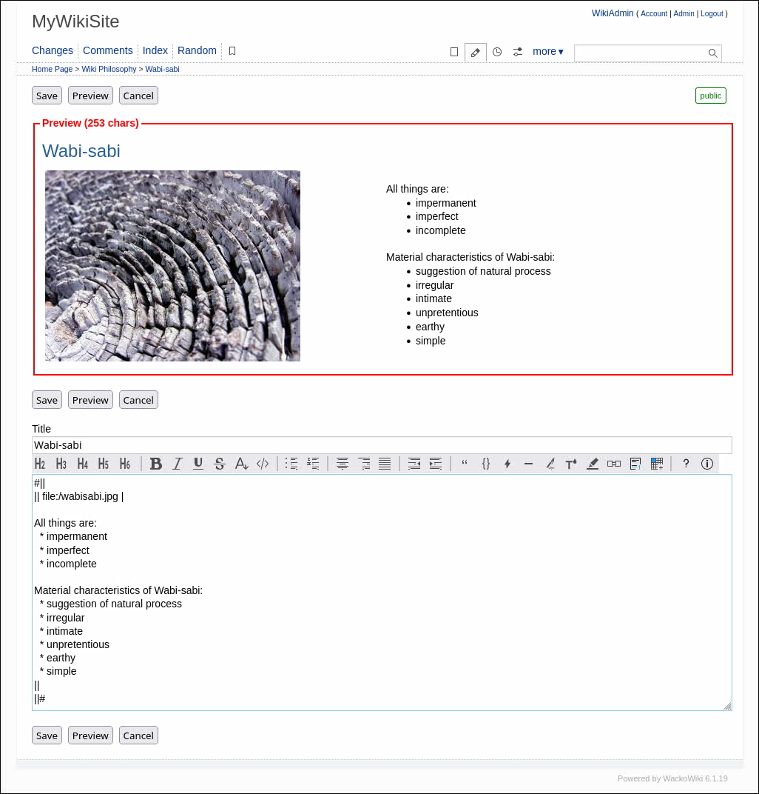

# WackoWiki

WackoWiki is a light and easy to install multilingual Wiki-engine. 
Supports WYTIWYG-editing, page rights (ACLs), design themes (skins), file upload, email notification and much more. Compatible with PHP 8.0 - 8.2 and MariaDB / MySQL.

## Instructions and help

WackoWiki community welcomes everyone, but before you ask a question, please get yourself familiar with the help content.

[User Guide](https://wackowiki.org/doc/Doc/English) | [News](https://wackowiki.org/doc/News)

## Community

We invite you to join any of our networks and stay up to date with the newest developments.

[Forums](https://wackowiki.org/doc/Forum) | [Sourceforge](https://sourceforge.net/projects/wackowiki/) | [GitHub](https://github.com/WackoWiki)

## Issues and feature requests

If you found a bug, or have an idea for new functionality, feel free to report it on the issue tracker - just use search beforehand.

[Issue tracker](https://wackowiki.org/bugs)

## Screenshot

